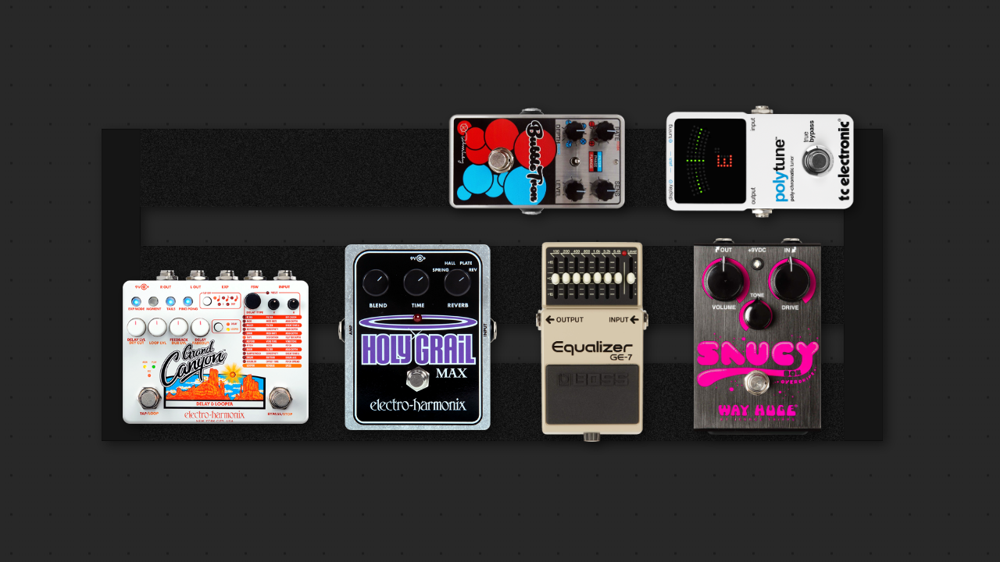
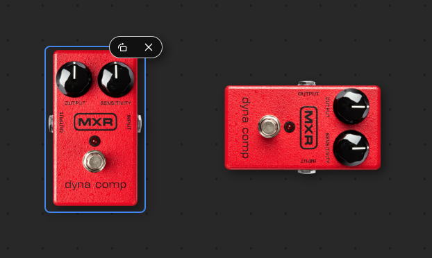
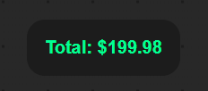
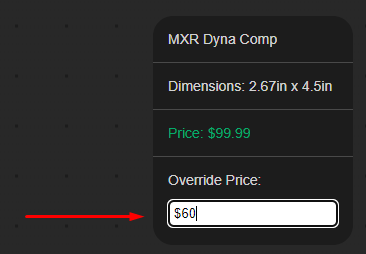

# Pedal Pricer


Pedal pricer is a tool for guitar players to budget and plan guitar effects pedalboards. It was built using React, ASP.NET Core, and Microsoft SQL Server, and takes inspiration from the existing [pedalplayground.com](https://pedalplayground.com).

Try the site out for yourself [here](https://pedalpricer.com).

## Usage

Using pedal pricer is very simple.

First, add any item using the sidebar on the left.

<br>



Every item can be rotated in 90 degree increments using the rotate bar on the top right of a selected pedal.

<br>



Pedal pricer keeps track of the total price of all items that are currently in the canvas.

<br>

> [!WARNING]
> Pedal pricer is still early in development.
> Since there are thousands of items, not all of them have price data as of now.

<br>

Because not every price can be completely accurate, Pedal Pricer offers a way to override price of any item. It can be found at the bottom of the info box when an item is selected.



The override price automatically applies to every instance of that item.

## API
The endpoints for reading data are publicly available. They accept an "item" parameter which returns json of the pedal with id "item".
### Sample response for pedal query
```json
[
    {
        "pedalID": 4970,
        "pedalBrand": "MXR",
        "pedalName": "Dyna Comp",
        "pedalWidth": 2.670,
        "pedalHeight": 4.500,
        "pedalPrice": 99.99,
        "pedalImageFilename": "mxr-m102.png"
    }
]
```

### Sample response for pedalboard query
```json
[
    {
        "pedalboardID": 1133,
        "pedalboardBrand": "Pedaltrain",
        "pedalboardName": "Metro 20",
        "pedalboardWidth": 20.000,
        "pedalboardHeight": 8.000,
        "pedalboardPrice": 0.00,
        "pedalboardImageFilename": "pedaltrain-metro20.png"
    }
]
```

### Sample response for power supply query
```json
[
    {
        "powerSupplyID": 1,
        "powerSupplyBrand": "T-Rex Engineering",
        "powerSupplyName": "Fuel Tank Chameleon",
        "powerSupplyWidth": 6.300,
        "powerSupplyHeight": 3.200,
        "powerSupplyPrice": 189.00,
        "powerSupplyImageFilename": "t-rex-engineering-fuel-tank-chameleon.png"
    }
]
```

These queries do support multiple values!

The /GetBasicInfo endpoint returns a lightweight response intended to provide the frontend with data that the user can pick.

## Dependencies
Pedal pricer relies on many react dependencies. If you intend to setup the project locally, you can install them with `npm install`
Here is a list of helpful react modules I made use of:
<ul>
  <li><a href="https://www.npmjs.com/package/react-currency-input-field">react-currency-input-field</a></li>
  <li><a href="https://www.npmjs.com/package/react-draggable">react-draggable</a></li>
  <li><a href="https://www.npmjs.com/package/react-icons">react-icons</a></li>
  <li><a href="https://www.npmjs.com/package/react-modal">react-modal</a></li>
  <li><a href="https://react-select.com/home">react-select</a></li>
  <li><a href="https://github.com/jacobworrel/react-windowed-select">react-windowed-select</a></li>
  <li><a href="https://styled-components.com/">styled-components</a></li>
</ul>

## Tests
To run the various end-to-end tests included in the repository, navigate to `ui/pedal-pricer/` and run `npx cypress open` (or alternatively `npx cypress run --headless` to run in the command line).

## Local Setup
1. Prerequisites:
   <ul>
     <li>Visual Studio</li>
     <li>An instance of SQL server</li>
     <li>SSMS</li>
     <li>A web compiler</li>
   </ul>

2. Publish the data to your local db
3. Verify that nuget packages are up to date and ready to use
4. Update the PedalAppCon property in api/PedalPricerAPI/appsettings.json with the proper connection string
5. Update the endpoints in ui/pedal-pricer/src/Variables.js
6. Verify that the dependencies listed above have been installed, you can do this by running `npm install`
7. In ui/pedal-pricer, run `npm start`

## Contributing
Pedal pricer is free and open source, meaning you can do whatever you like with it. I do not ever plan on monetizing this application
If you'd like to help with the development of the project, there are many ways you can do so:
<ul>
  <li>Contribute code to the repo</li>
  <li>Suggest new features</li>
  <li>Report security vulnerabilities or code errors</li>
  <li>Add price data</li>
</ul>

Please feel free to open a [pull request](https://github.com/4acf/pedal-pricer/pulls), you will be credited accordingly.
